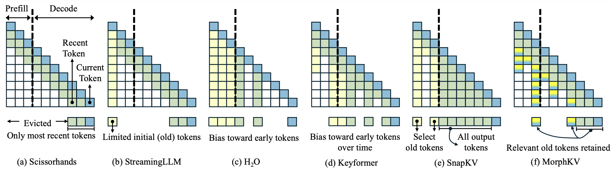
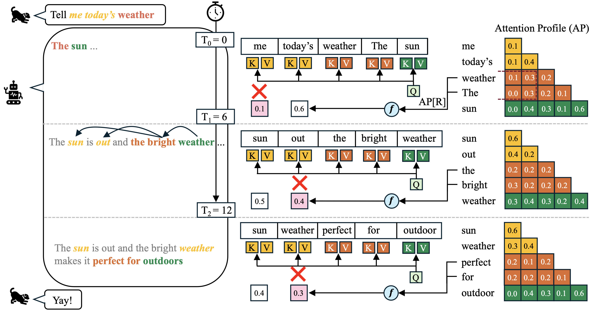

# MorphKV: Dynamic Token Eviction for Efficient KV Cache Management 

  

## [ICML'25] Dialogue Without Limits: Constant-Sized KV Caches for Extended Responses in LLMs

This repository contains the code for MorphKV, a dynamic KV cache compression technique that maintains a constant-sized KV cache while preserving contextual coherence. MorphKV iteratively refines the KV cache via lightweight updates guided by the attention patterns of recently generated tokens. This approach captures inter-token correlation with greater accuracy, enabling MorphKV to identify, and retain only the most relevant older tokens. Our studies on long-response tasks show upto 52.9% memory savings and 18.2% higher accuracy as compared to state-of-the-art prior works such as SnapKV, and $H_2O$, enabling efficient real-world deployment.

**Arxiv Pre-print: https://arxiv.org/pdf/2503.00979**

  

Unlike prior works such as SnapKV which prune the KV cache only at the beginning of response-generation, MorphKV is a dynamic, correlation-aware algorithm and performs eviction at every generation step, thereby maintaining a constant-sized KV cache throughout inference. Our experiments demonstrate that MorphKV scales efficiently with response length, degrading only 10% in performance even as outputs grow to 12K tokens, compared to 15–18% degradation for state-of-the-art prior works. Furthermore, MorphKV is also compatible with the Grouped-Query-Attention (GQA), used in modern LLM architectures such as Llama-3.1. These advances position MorphKV as a practical inference-time solution, balancing both accuracy, and memory constraints without sacrificing the ability to capture long-range contextual dependencies.

## MorphKV - Design

  

Fundamentally, MorphKV's design leverages two key aspects: 1. Retaining recent tokens for local coherence and, 2. Identifying important older tokens for distant relevance using the attention pattern of recent tokens. In the above shown example, note how the relevant context dynamically shifts as token generation progresses. By leveraging these design principles, MorphKV maintains a lightweight KV cache storing only the most relevant tokens. This leads to a substantial decrease in memory usage, enabling the system to handle more requests simultaneously, thereby improving overall system-throughput.

### Usage
MorphKV is integrated within the huggingface transformer library, allowing it to be used through simple monkeypatching of a few transformer classes. 

#### 1. Pre-Requisites
Currently, MorphKV is thoroughly tested with transformers 4.45.0 and hence we recommend maintaining this version of transformers for running MorphKV, particularly since the attention class has undergone major restructuring in the recent versions.

<pre>
  pip install transformers==4.45.0
</pre>

#### 2. Install morphkv

<pre>
  git clone https://github.com/ghadiaravi13/MorphKV/
  cd MorphKV/
  pip install .
</pre>

# Benchmarks

## [LongGenBench](https://github.com/mozhu621/LongGenBench/)

We test the effectiveness of MorphKV on long-response generation task: LongGenBench. The code present here is derived from the original LongGenBench repository.

### Performance

**Note:** MorphKV achieves better scores across almost all evaluation metrics — Completion Rate (CR), Accuracy Once, Accuracy Range, Accuracy Periodic, and Accuracy Average.

| Model Group | Variant     | CR (%) | Once (%) | Range (%) | Periodic (%) | Avg. (%) |
|-------------|-------------|--------|----------|------------|----------------|-----------|
| **Llama**   | H2O         | 64     | 45       | 60         | **27**         | 44        |
|             | SnapKV      | 64     | 50       | 55         | 26             | 44        |
|             | **MorphKV** | **64** | **50**   | **61**     | 24             | **45**    |
| **Mistral** | H2O         | 71.2   | 57       | 60         | 32             | 50        |
|             | SnapKV      | 71     | 55       | 57         | 36             | 49        |
|             | **MorphKV** | **71.2**| **57**   | **62**     | **36**         | **52**    |
| **Qwen**    | H2O         | **55** | **46**   | 51         | 28             | 42        |
|             | SnapKV      | 53     | 44       | 46         | 28             | 39        |
|             | **MorphKV** | 51     | 43       | **68**     | **30**         | **47**    |

### Running LongGenBench

Launching the inference on LongGenBench: The model generates response for the corresponding LongGenBench tasks such as writing a floor-plan, diary etc. and gets saved to the JSON file. Subsequently, the JSON file is used to perform eval.

<pre>
  cd LongGenBench/Evalution
  python inference_hf.py --model mistral -ws 200 -mc 4000 --morph_type max_fused --input_file ../Dataset/Dataset_short.json --preds_path preds --output_file preds/Mistral.json
</pre>

### Evaluating LongGenBench
<pre>
  python eval.py --data preds/Mistral.json --csv preds/lgb_eval.csv
</pre>

## [LongWriter](https://github.com/THUDM/LongWriter)

For another long-response benchmark, we use LongWriter, which has more open-ended response generation tasks, like writing a 1000 word essay on a given topic etc. The code present in this repository is derived from the original LongWriter repository.

### Performance

Average LLM Judge scores across different methods and models on LongWriter benchmark

| Model         | Llama | Mistral | Phi4 | Qwen |
|---------------|:-----:|:-------:|:----:|:----:|
| ho            | 68.5  | 80.0    | 61.5 | 63.8 |
| SnapKV        | 67.7  | 81.1    | 63.8 | **68.4** |
| MorphKV       | **69.5** | **81.1** | **64.7** | 64.9 |
| Full-Attention| 66.5  | 81.3    | 62.9 | 66.2 |

### Running LongWriter
<pre>
  python pred.py --model mistral -ws 30 -mc 600 --morph_type sum_fused --pred_path preds
</pre>

### Evaluating LongWriter:

For LongWriter, there are two evaluation methods: length and quality. 
Length measures how well the model was able to follow the prompt in terms of meeting the length requirement. 
<pre>
  python eval_length.py --model mistral --pred_path preds
</pre>

Quality measures the response quality across several metrics as per the original LongWriter benchmark, which uses LLM as a judge to estimate the quality of the responses. For our evaluation, we use a Mistral-Large-123B as the judge model. This script also support OpenAI APIs, so user may choose any other model which supports this API format.
<pre>
  python eval_quality.py --model mistral --pred_path preds
</pre>

## [LongBench](https://github.com/THUDM/LongBench)

We also evaluate MorphKV performance on LongBench, which is a long-context benchmark-suite with diverse benchmarks across retrieval, reasoning, and Question-Answering. The code present in this repository is derived from the original LongBench repository.

### Performance

| Model   | Variant        | 2wmqa    | drdr     | hpqa     | mnews    | mfqa\_en | mfqa\_zh | musq     | nqa      | pcnt     | prt      | qsp      | qms      | sams     | tqa      | vcs      |
| ------- | -------------- | -------- | -------- | -------- | -------- | -------- | -------- | -------- | -------- | -------- | -------- | -------- | -------- | -------- | -------- | -------- |
| Llama   | SnapKV         | **16.0** | 22.0     | 14.9     | 25.6     | 25.4     | 18.7     | **10.7** | **32.2** | **7.6**  | **98.4** | 11.7     | 23.1     | **42.9** | **91.7** | 14.2     |
|         | MorphKV (ours) | 14.9     | **22.5** | **15.9** | **26.6** | **25.7** | **19.9** | **10.7** | 31.9     | 7.5      | 97.8     | **11.9** | **23.6** | **42.9** | 91.5     | **15.2** |
|         | Full Attention | 16.5     | 30.0     | 16.7     | 26.8     | 27.4     | 20.1     | 11.4     | 32.0     | 6.9      | 97.7     | 13.2     | 23.6     | 43.7     | 91.6     | 16.1     |
| Mistral | SnapKV         | 26.6     | 23.7     | 40.5     | 26.0     | **48.8** | 41.3     | **18.3** | 25.6     | 2.5      | **88.6** | **31.0** | **23.8** | 41.9     | **86.3** | 13.5     |
|         | MorphKV (ours) | **26.7** | **23.9** | **40.8** | **26.6** | 48.4     | **43.0** | 16.7     | **26.7** | **3.0**  | 85.9     | 30.9     | 23.6     | **42.3** | **86.3** | **13.7** |
|         | Full Attention | 27.1     | 30.4     | 43.0     | 27.1     | 49.2     | 48.3     | 18.8     | 26.7     | 2.8      | 87.0     | 33.0     | 24.2     | 42.8     | 86.2     | 15.2     |
| Phi-4   | SnapKV         | 22.3     | **24.2** | **19.5** | 25.0     | 38.0     | **47.2** | 5.2      | 20.5     | **12.6** | 63.9     | **32.4** | 22.1     | 47.2     | 90.5     | 11.4     |
|         | MorphKV (ours) | **22.6** | 24.1     | 19.3     | **25.5** | **38.2** | 46.4     | **6.2**  | **21.0** | **12.6** | **64.3** | 31.2     | **22.4** | **47.6** | **90.6** | **12.3** |
|         | Full Attention | 22.2     | 29.0     | 19.6     | 25.9     | 38.2     | 48.9     | 6.0      | 20.7     | 11.6     | 63.3     | 33.3     | 22.9     | 48.2     | 90.4     | 13.4     |

### Running LongBench

<pre>
  python pred_single.py --model mistral -ws 32 -mc 2000 --morph_type sum_fused --pred_path preds
</pre>

### Evaluating LongBench
<pre>
  python eval.py --model mistral --pred_path preds
</pre>

