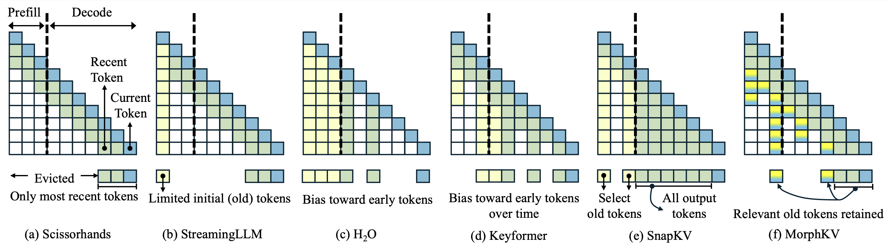
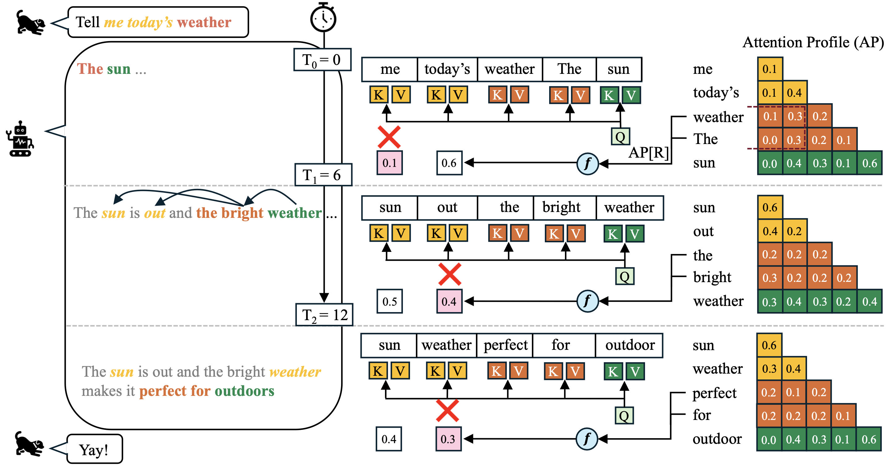

# MorphKV: Dynamic Token Eviction for efficient KV cache management

  

## [ICML'25] Dialogue Without Limits: Constant-Sized KV Caches for Extended Responses in LLMs

This repository contains the code for MorphKV, a dynamic KV cache compression technique that delivers massive memory savings compared to SOTA methods like SnapKV and $H_2O$,
while also improving upon the benchmark accuracy scores. MorphKV uses a window of recent tokens to gather information about the importance of the distant context tokens.
Hence, it uses a two-fold approach: 1. retain all the recent window tokens in the KV cache, and 2. Identify the top-K most important distant tokens and retain them in the KV cache.

**Paper Link: https://arxiv.org/pdf/2503.00979**

  

Unlike prior methods like SnapKV, MorphKV is a dynamic algorithm and performs eviction at every timestep, thereby maintaining a constant-sized KV cache throughout inference.
Further, MorphKV also accounts for GQA, thereby allowing better practical adoption, since many models today use GQA as an architecture choice.

## MorphKV - Design

  

Fundamentally, MorphKV's design leverages two key aspects of LLM Inference: 1. retaining recent tokens for local coherence and, 2. Identifying important past tokens for distant relevance. In the example shown below, note how the relevant context dynamically shifts as token generation progresses.
By leveraging this behaviour, MorphKV allows to retain a very lightweight KV cache comprising of only the relevant information, massively reducing the memory overhead, thereby improving system-throughput.

### Usage
MorphKV is integrated within the huggingface transformer library, and hence can be used via simple monkeypatching of a few transformer classes. 

#### 1. Pre-Requisites
Currently, MorphKV is thoroughly tested with transformers 4.45.0 and hence we recommend maintaining this version of transformers for running MorphKV, particularly since the attention class has undergone major restructuring in the recent versions.

<pre>
  pip install transformers==4.45.0
</pre>

#### 2. Install morphkv

<pre>
  git clone https://github.com/ghadiaravi13/MorphKV/
  cd MorphKV/
  pip install .
</pre>

# Benchmarks

## [LongGenBench](https://github.com/mozhu621/LongGenBench/)

We test the effectiveness of MorphKV on long-response generation task: LongGenBench. The code present here is derived from the original LongGenBench repository.

### Running LongGenBench

Launching the inference on LongGenBench: The model generates response for the corresponding LongGenBench tasks such as writing a floor-plan, diary etc. and gets saved to the JSON file. Subsequently, the JSON file is used to perform eval.

<pre>
  cd LongGenBench
  python inference_hf.py --model mistral -ws 200 -mc 4000 --morph_type max_fused --input_file ../Dataset/Dataset_short.json --preds_path preds --output_file preds/Mistral.json
</pre>

### Evaluating LongGenBench
<pre>
  python eval.py --data preds/Mistral.json --csv preds/lgb_eval.csv
</pre>

## [LongBench](https://github.com/THUDM/LongBench)

We also evaluate MorphKV performance on LongBench, which is a long-context benchmark-suite with diverse benchmarks across retrieval, reasoning, and Question-Answering. The code present in this repository is derived from the original LongBench repository.

### Running LongBench

<pre>
  python pred_single.py --model mistral -ws 32 -mc 2000 --morph_type sum_fused --pred_path preds
</pre>

### Evaluating LongBench
<pre>
  python eval.py --model mistral --pred_path preds
</pre>

